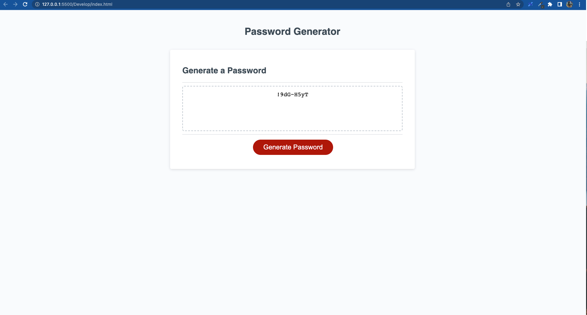

## Password-Generator

In this project, I created an application that enables employees to generate random passwords based on criteria that they’ve selected.
This app will run in the browser and dynamically updated HTML and CSS powered by JavaScript. 

## Table of Contents

- [Tasks Completed](#TaskCompleted)
- [Links](#Links)
- [Screenshot](#Screenshot)
- [License](#license)
- [Credits](#credits)

## Tasks Completed

- Used window.Prompt for password criteria
- Used window.Prompt for length of the password
- Asked the user for character type to include in the password using window.Confirm
- Used loop(for) to generate the final password
- Added comments in script.js

## Links

Website URL     -  https://aungphyohan5.github.io/Password-Generator/

Repository URL  -  https://github.com/Aungphyohan5/Password-Generator

## Screenshot

## License

MIT

## credits

- W3school (https://www.w3schools.com/)

